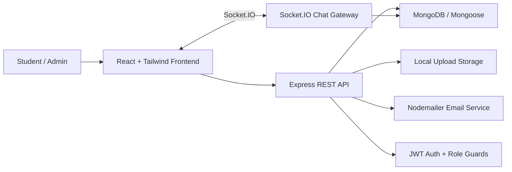

# Campus Resell Portal

Premium campus marketplace for buying, selling, saving, reviewing, reporting, and chatting about student-to-student listings.

Campus Resell Portal is a full MERN application with authenticated product listing flows, wishlist management, real-time chat, admin moderation, notifications, reviews, profile management, avatar uploads, and a polished responsive SaaS-style interface.

## Architecture



## Key Features

- Premium responsive UI with collapsible sidebar, dark mode, skeleton loaders, empty states, and toast notifications.
- Product marketplace with search, filters, categories, reviews, image uploads, status badges, wishlist, and seller controls.
- Real-time chat with message status, typing indicators, per-message actions, chat deletion, reporting, and unread counts.
- Secure authentication with JWT, password reset flow, avatar uploads, profile editing, and robust public/institutional email validation.
- Admin tools for user management, reports, moderation, banning, and system stats.
- Production-minded backend structure with controllers, routes, middleware, services, Mongoose models, and Socket.IO integration.

## Tech Stack Matrix

| Layer | Technologies |
| --- | --- |
| Frontend | React 19, Vite, React Router, Tailwind CSS 4, Axios, React Hot Toast, Socket.IO Client |
| Backend | Node.js, Express 5, JWT, bcryptjs, Multer, Nodemailer, Socket.IO |
| Database | MongoDB, Mongoose schemas, indexed user/product fields |
| DevOps | Vite production build, npm scripts, environment-driven backend config |

## Quick Start

Run the backend and frontend in two terminals:

```bash
cd backend && npm install && npm run dev
```

```bash
cd frontend && npm install && npm run dev
```

Default local URLs:

- Frontend: `http://localhost:5173`
- Backend: `http://localhost:5001`

## Environment Overview

Backend expects MongoDB, JWT, and optional email credentials in `backend/.env`. Frontend can run with the default API configuration used in `src/services/api.js`.

## Repository Structure

```text
Campus-Resell-Portal/
  backend/      Express API, Socket.IO, MongoDB models, uploads, services
  frontend/     React client, route pages, UI components, context, services
```

## Production Readiness Notes

- Keep secrets in environment files and never commit real credentials.
- Configure CORS origins before public deployment.
- Move local uploads to object storage for distributed deployments.
- Add CI checks for `npm run build`, lint, and API smoke tests before merging.
